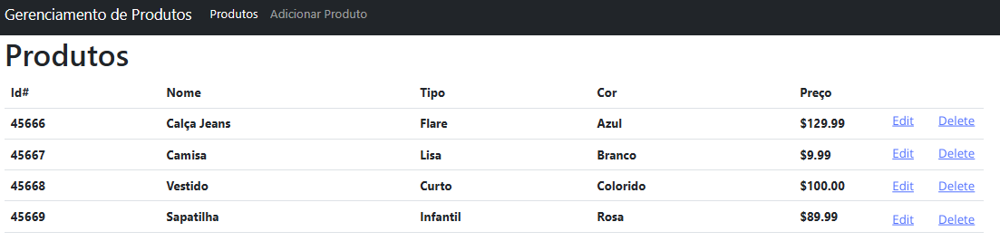

# Sistema de Gerenciamento de Produtos 

Este é um projeto de exemplo que demonstra como criar um Sistema de Gerenciamento de Produtos usando as tecnologias ASP.NET Web API, Angular 16 e Entity Framework Core. O sistema é uma aplicação web que permite aos usuários gerenciar informações sobre produtos, incluindo adição, edição, exclusão e visualização de detalhes.

 
    

## Funcionalidades

- Listagem de produtos: Veja uma lista de todos os produtos disponíveis.
- Adição e edição de produtos: Adicione novos produtos ou edite os existentes com informações relevantes.
- Detalhes do produto: Visualize detalhes completos de um produto específico.
- Integração Frontend e Backend: Comunicação entre o frontend Angular e o backend ASP.NET Web API para manipular dados.

## Tecnologias Utilizadas

- ASP.NET Web API: Crie uma API RESTful para gerenciar operações de CRUD para produtos.
- Angular 16: Desenvolva uma interface de usuário dinâmica e interativa para interagir com a API.
- Entity Framework Core: Mapeie objetos C# para o banco de dados, simplificando as operações de banco de dados.
- SQL Server: Banco de dados para armazenar informações sobre produtos.

## Configuração do Ambiente de Desenvolvimento

Certifique-se de ter as seguintes ferramentas instaladas:

- Visual Studio ou Visual Studio Code para desenvolvimento ASP.NET.
- Node.js e npm para desenvolvimento Angular.
- SQL Server para o Entity Framework Core.

## Executando o Projeto

1. Clone este repositório para a sua máquina.
2. Configure o ambiente de desenvolvimento de acordo com as instruções acima.
3. Abra o projeto ASP.NET no Visual Studio ou Visual Studio Code.
4. Configure a conexão com o banco de dados no Entity Framework Core.
5. Execute o projeto ASP.NET para iniciar a API.
6. Abra o terminal na pasta do projeto Angular.
7. Execute `npm install` para instalar as dependências.
8. Execute `ng serve` para iniciar o servidor de desenvolvimento do Angular.
9. Acesse a aplicação em seu navegador através do endereço `http://localhost:4200`.
